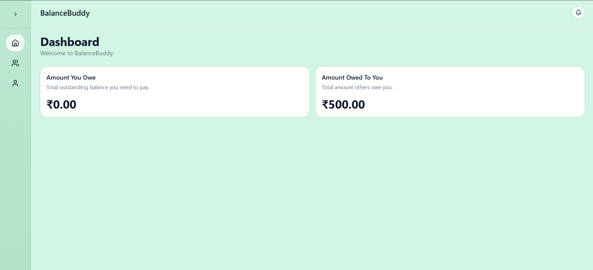
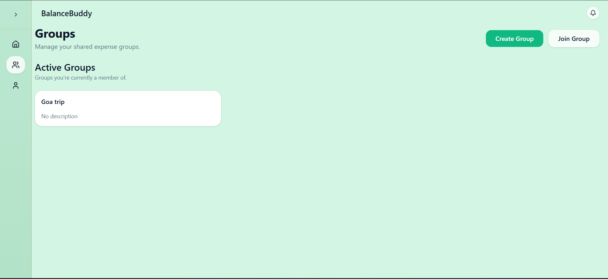
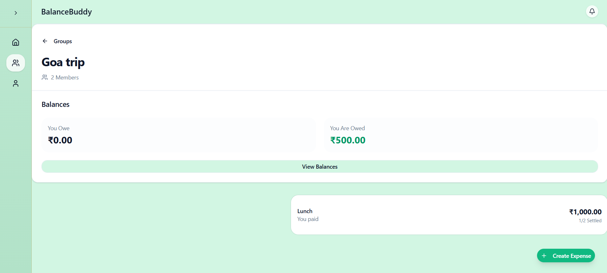
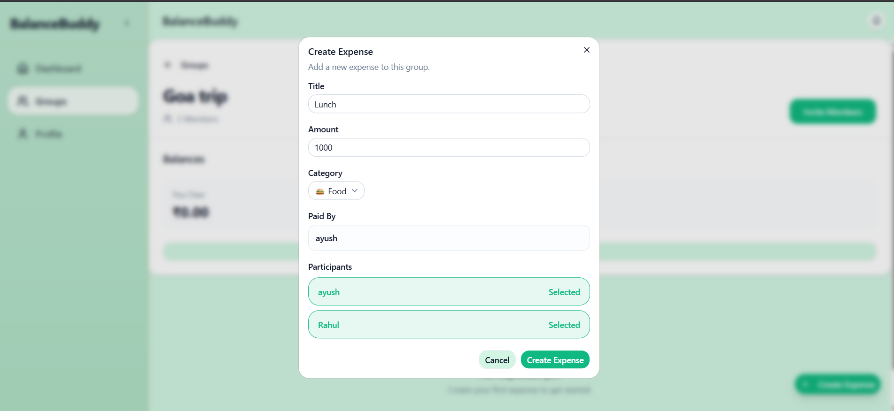
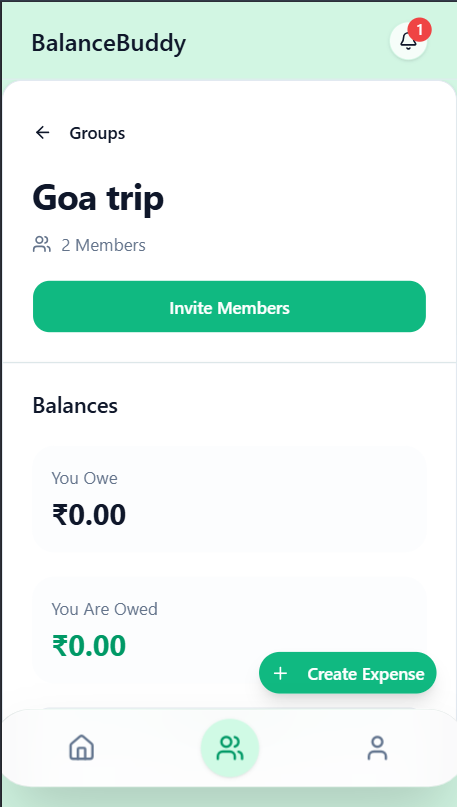

# BalanceBuddy

> A production-inspired collaborative expense sharing application built with a modern full-stack architecture.

BalanceBuddy is a full-stack expense splitting application that helps groups manage shared expenses, track balances, and settle payments effortlessly. Whether it's a trip with friends, roommates sharing monthly bills, or organizing an event, BalanceBuddy keeps everyone's expenses transparent and synchronized in real time. Inspired by the simplicity of Google Pay's group expense experience, the project focuses on clean architecture, scalability, and modern software engineering practices.

---

## Live Demo

🚀 **Live Application:** https://your-vercel-url.vercel.app

---

## Features

### 👤 Secure Authentication

Create an account, securely log in, manage your profile, and recover access using email-based password reset. Authentication is powered by JWT with refresh tokens stored in HTTP-only cookies, providing a secure and seamless user experience.

### 👥 Group Management

Create groups for trips, events, or shared living arrangements, invite members using shareable invite links, and collaborate on expenses together. Once a group starts recording expenses, memberships are automatically locked to maintain financial consistency.

### 💸 Expense Tracking

Record shared expenses with support for equal and exact amount splitting. Organize expenses using categories, keep track of who paid, and maintain a complete financial history through immutable expense records.

### ⚖️ Balance Management

Automatically calculate balances for every member based on recorded expenses. View how much you owe, how much others owe you, settle individual expense shares, or clear all outstanding balances with a single action.

### ⚡ Real-Time Collaboration

Every expense creation, settlement, and group update is synchronized instantly across all connected users, ensuring everyone always sees the latest information without refreshing the page.

### 📱 Responsive Experience

BalanceBuddy is designed with a mobile-first approach and delivers a clean, responsive experience across desktops, tablets, and smartphones.

---

## Technical Highlights

- JWT Authentication with Access & Refresh Tokens
- HTTP-only Cookie Based Session Management
- Real-Time Synchronization using Socket.IO
- Redis Caching for Faster Dashboard Loading
- BullMQ Background Jobs for Email Processing
- PostgreSQL with Prisma ORM
- Layered Backend Architecture (Controller → Service → Repository)
- TanStack Query for Efficient Server State Management
- Zustand for Global Client State Management
- React Hook Form + Zod Validation
- Responsive UI built with Tailwind CSS v4 & shadcn/ui
- Deployed using Vercel (Frontend) and Railway (Backend)

---

## Screenshots

> Screenshots will be added here.

### Dashboard



### Groups



### Group Details



### Expense Details



### Mobile View



---

## Tech Stack

### Frontend

- React 19
- TypeScript
- Vite
- Tailwind CSS v4
- shadcn/ui
- React Router
- TanStack Query
- Zustand
- React Hook Form
- Zod

### Backend

- Node.js
- Express.js
- TypeScript
- Prisma ORM
- PostgreSQL

### Infrastructure & Services

- Redis
- BullMQ
- Socket.IO
- Railway
- Vercel

### Developer Tools

- ESLint
- Prettier
- Husky
- Docker
- Git

---

## Getting Started

### Clone the Repository

```bash
git clone https://github.com/your-username/BalanceBuddy.git
cd BalanceBuddy
```

### Install Dependencies

```bash
# Frontend
cd client
npm install

# Backend
cd ../server
npm install
```

### Configure Environment Variables

Create the required `.env` files for both the frontend and backend before starting the application.

### Run the Application

Frontend

```bash
cd client
npm run dev
```

Backend

```bash
cd server
npm run dev
```

---

## Key Engineering Decisions

### Immutable Financial Records

Expenses are never edited after creation. If an expense is incorrect, it can be cancelled and recreated, ensuring a consistent and auditable financial history.

### Dynamic Balance Calculation

Balances are calculated dynamically from expense shares instead of being stored separately, making PostgreSQL the single source of truth and preventing synchronization issues.

### Secure Session Management

Short-lived access tokens are paired with long-lived refresh tokens stored in HTTP-only cookies, improving both security and user experience.

### Real-Time Updates

Socket.IO broadcasts expense creation, settlements, and group updates instantly to all connected users, while TanStack Query keeps the frontend synchronized efficiently.

### Background Processing

Time-consuming tasks such as transactional email delivery are handled asynchronously using BullMQ, allowing the API to remain fast and responsive.

---

## License

This project is licensed under the MIT License.